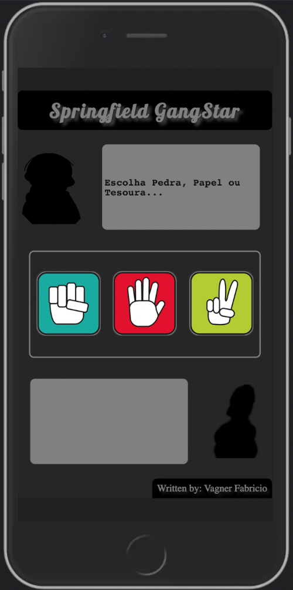
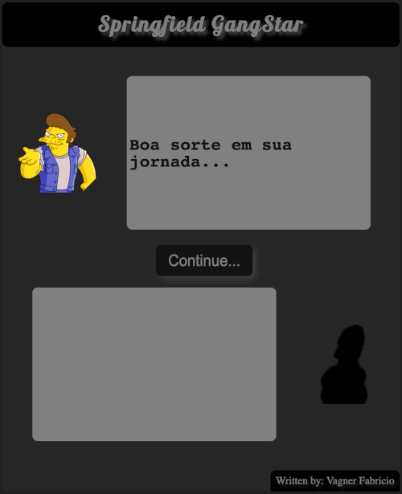

# Springfield GangStar - a rock paper scissors game!!!

Try to beat your opponents through a game of rock-paper-scissors to discover your true identity.
The starting characters will give you tips to beat them.

Project developed in JavaScript, HTML5 and CSS3. OOP (Object-Oriented Programming).

GitHub Pages link: [https://wagnerfabricio.github.io/jogo-de-azar-wagnerfabricio/](https://wagnerfabricio.github.io/jogo-de-azar-wagnerfabricio/)

<td valign="top" width="33%">

## Images:

</td>

<td valign="top" width="33%">

### Techs:

</td>
